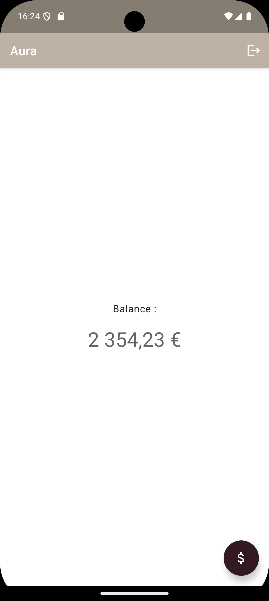

<a name="readme-top"></a>

<div align="center">
  

  <h1>Aura Android</h1>
  <p>Application mobile de néobanque — Projet OpenClassrooms #4</p>

  
  
  
  
  
</div>

---

## À propos

**Aura** est une application Android de néobanque (style Lydia / PayPal) développée en Kotlin natif dans le cadre du **Projet 4 OpenClassrooms** (parcours Développeur Android).

L'objectif de la mission est d'**intégrer des données provenant d'une API REST** dans une application existante, en respectant l'architecture **MVVM** et les bonnes pratiques Android modernes (Coroutines, StateFlow, Repository pattern, tests unitaires).

---

## Captures d'écran

<div align="center">
  
</div>

---

## Fonctionnalités

### Écran de connexion
- Activation du bouton uniquement quand les deux champs sont remplis
- Appel API REST (POST `/login`) avec gestion des identifiants
- État **Loading** : ProgressBar + bouton désactivé pendant la vérification
- État **Success** : navigation vers l'écran principal (back stack nettoyée)
- État **Error** : message d'erreur Toast, bouton réactivé

### Écran principal — Solde du compte
- Récupération du solde via API (GET `/accounts/{userId}`)
- Filtre sur le compte `main = true` pour afficher le compte principal
- État **Loading** : ProgressBar pendant le chargement
- État **Success** : affichage du solde formaté (ex. `2 331,31 €`)
- État **Error** : message d'erreur + bouton **Réessayer** pour relancer la requête

### Écran de transfert
- Activation du bouton uniquement si le bénéficiaire est renseigné ET le montant > 0
- Appel API REST (POST `/transfer`) avec envoi du montant au bénéficiaire
- État **Loading** : ProgressBar + bouton désactivé pendant l'envoi
- État **Success** : retour à l'écran principal avec rechargement du solde via API
- État **Error** : message d'erreur Toast, bouton réactivé

---

## Architecture MVVM

Ce projet respecte strictement l'architecture **Model-View-ViewModel** :

```
┌─────────────────────────────────────────────────┐
│  VIEW  (Activity)                               │
│  Affiche l'UI, observe le ViewModel             │
│  Aucune logique métier                          │
└──────────────┬──────────────────────────────────┘
               │ observe (StateFlow)
               ▼
┌─────────────────────────────────────────────────┐
│  VIEWMODEL                                      │
│  Toute la logique métier                        │
│  Expose des UiState via StateFlow               │
└──────────────┬──────────────────────────────────┘
               │ appelle
               ▼
┌─────────────────────────────────────────────────┐
│  REPOSITORY  (AuraRepository)                   │
│  Abstraction entre ViewModel et source de données│
└──────────────┬──────────────────────────────────┘
               │ appelle
               ▼
┌─────────────────────────────────────────────────┐
│  API SERVICE  (Retrofit / AuraApiService)       │
│  Appels HTTP vers le backend local              │
└─────────────────────────────────────────────────┘
```

Chaque écran expose une `sealed class UiState` (`Idle` / `Loading` / `Success` / `Error`) observée par l'Activity via `lifecycleScope`.

---

## Stack technique

| Composant | Bibliothèque | Version |
|-----------|-------------|---------|
| Langage | Kotlin | 1.9 |
| HTTP client | Retrofit + OkHttp | 2.11.0 / 4.12.0 |
| Parsing JSON | Moshi (réflexion KotlinJsonAdapterFactory) | 1.15.1 |
| Async | Coroutines Kotlin | 1.8.0 |
| Réactivité | StateFlow / `combine()` | — |
| ViewModel | Lifecycle ViewModel KTX | 2.8.0 |
| Tests | JUnit 4 + MockK | 4.13.2 / 1.13.10 |
| Debug réseau | OkHttp Logging Interceptor | 4.12.0 |

---

## Structure du projet

```
app/src/main/java/com/aura/
├── data/
│   ├── api/
│   │   ├── AuraApiService.kt       ← Interface Retrofit (routes HTTP)
│   │   ├── RetrofitInstance.kt     ← Singleton Retrofit + Moshi
│   │   ├── LoginRequest.kt / LoginResponse.kt
│   │   └── AccountResponse.kt
│   └── repository/
│       └── AuraRepository.kt       ← Couche d'abstraction des données
└── ui/
    ├── login/
    │   ├── LoginActivity.kt
    │   └── LoginViewModel.kt
    ├── home/
    │   ├── HomeActivity.kt
    │   └── HomeViewModel.kt
    └── transfer/
        ├── TransferActivity.kt
        └── TransfertViewModel.kt
```

---

## Lancer le projet

### 1. Démarrer le serveur API local

Le projet requiert un backend local (fourni par OpenClassrooms). Ouvrir le projet serveur dans **IntelliJ IDEA** et le lancer. Le serveur démarre sur le port `8080` — l'affichage s'arrête à 80 %, c'est normal.

La documentation Swagger est accessible à : `http://localhost:8080/swagger-ui`

### 2. Configurer l'URL de base

Dans `RetrofitInstance.kt`, vérifier l'URL selon le cas d'usage :

```kotlin
// Émulateur Android
private const val BASE_URL = "http://10.0.2.2:8080/"

// Téléphone physique (remplacer par l'IP locale de la machine)
private const val BASE_URL = "http://192.168.X.X:8080/"
```

### 3. Lancer l'application

Ouvrir le projet dans **Android Studio**, sélectionner un émulateur (API 24+) et cliquer sur **Run**.

---

## Tests unitaires

Les ViewModels sont couverts par **20 tests unitaires** (JUnit 4 + MockK) — tous au vert.

```bash
./gradlew testDebugUnitTest
```

Le rapport HTML est généré dans :
```
app/build/reports/tests/testDebugUnitTest/index.html
```

Les tests couvrent :
- `LoginViewModelTest` — activation du bouton, états Loading/Success/Error
- `HomeViewModelTest` — chargement de la balance, retry, états d'erreur
- `TransferViewModelTest` — validation du formulaire, états du transfert

---

<div align="center">
  <sub>Projet réalisé dans le cadre du parcours <strong>Développeur Android — OpenClassrooms</strong></sub>
</div>
